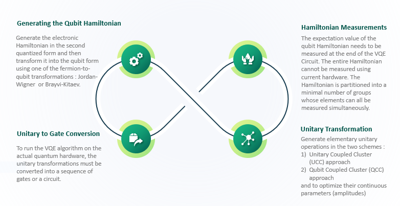
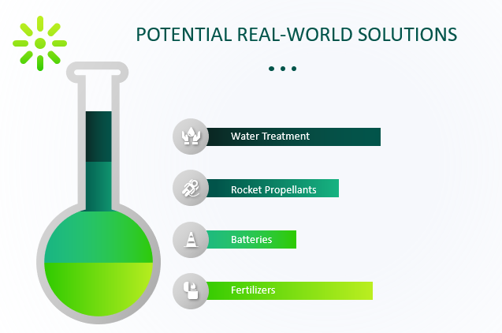
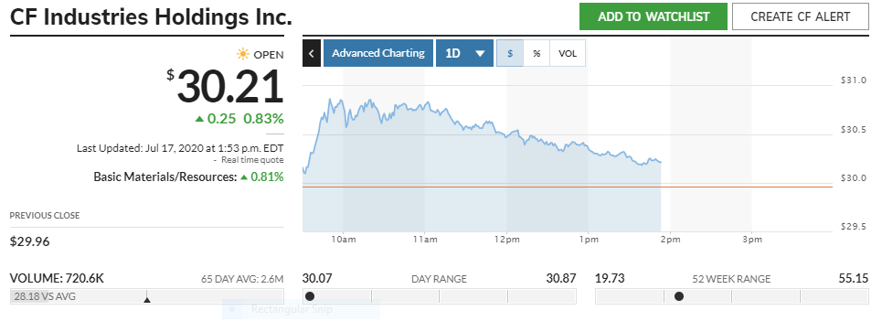

# Quantum Cohort Project Business Application

## Step 1: Explain the technical problem you solved in this exercise

We use Variational Quantum Eigensolver (VQE) to obtain the potential energy surfaces (PES) for small molecules. Currently, the variational quantum eigensolver (VQE) is the most feasible technique for solving the electronic structure problem on a near term nosiy quantum computers. We study the PES for following molecules using both classical and quantum methods : H2, LiH, H2O and N2. H2 and LiH are weakly correlated while H2O and N2 are strongly correlated systems. Classical state-of-the-art methods like CCSD fail to perform accurate calculations for strongly correlated systems. Thus, quantum computing methods based on VQE provide a potential solution to this problem. These methods not only promise to efficiently perform calculations of larger and complex systems with improved chemical accuracy [1], but also provide an ability to calculate additional properties like charge density, dipole moment etc.[2]

The quantum subroutine has two fundamental steps :
1) Prepare the quantum state called ansatz.
2) Measure the expectation value.

The variational principle bound allows us to use classical computation to run an optimization loop to find their eigenvalue :
1) Use a classical, non-linear optimizer to minimize the expectation value by varying ansatz parameters.
2) Iterate until convergence.

 

## Step 2: Explain or provide examples of the types of real-world problems this solution can solve

**On the path of achieving quantum advantage for real world applications....**

There are a number of real world problems this solution can solve, including water treatment, fertilizer manufacturing and more efficient battery production processes.

**Water Treatment** : This market is valued at USD 23.80 billion in 2016. It is expected to register a CAGR of 7.1% by 2025. The industry can be classified into residential and non-residential segments. The residential segments account for 115.2 million units. Exponential growth in residential construction across the world is expected to contribute significantly to the growth of this application segment. The world’s move toward greener chemistry — the reduction of hazardous substances in producing chemicals and reducing pollution — requires new ways to replace organic solvents with water, to better understand water’s role in reaction mechanisms, and to better understand how solutes and toxins partition into the environment. Better ways are needed to separate water from other materials, such as organic solids, bacteria, and hydrocarbons. To learn how material properties are encoded within molecular structures requires more than just experiments. It also requires models, theories, and simulations. Without modeling, we cannot interpret observable properties in terms of water’s molecular structure, energetics, and statistical distributions.[3]

**Fertlizer Manufacturing** : Creating energy efficient processes to manufacture ammonia is a $11 billion problem without a solution. Ammonia is currently produced through the Haber-Bosch process, which utilizes a synthetic reaction with hydrogen and nitrogen gas. This requires extremely high pressure and temperature conditions as well as an expensive metal catalyst. The application of quantum computing capabilities to simulate the dissociation of the triple bond in the nitrogen molecule will help to create a more energy efficient methof of ammonia synthesis.[8]

**Chemical Industry** : Lithium hydride is used in the production of a variety of reagents for organic synthesis, such as lithium aluminium hydride (LiAlH4) and lithium borohydride (LiBH4). Thus studying it's structure and properties can be imperative in identifying new efficient methods to produce reagents.[4]

**Efficient Battery Production** : A current disadvantage of electric vehicles is the capacity and speed of charging of their batteries. Besides electric vehicles, many smartphone batteries are based on lithium ion- fast charging and efficient storage is a current hot problem that needs to be solved. A lithium ion battery costs between $7000-$20000 for a vehicle thereby making it most expensive item in cost of vehicle. Additionally, inefficient charging increases electricity consumption. A step towards efficient energy storage and charging mechanisms can reduce electricity consumption too. Quantum computers can be used to model the dipole moment of three lithum containing molecules, bringing us closer to the next-generation lithium sulfur (Li-S)[7] batteries that would be more powerful, longer lasting and cheaper than today’s widely used lithium ion batteries.[5]

**Small Rocket Propellants** : LiH has been studied as potential nuclear rocket propellant along with Liquid Hydrogen. Currently, the feasibility of using LiH as a nuclear rocket propellant appears remote without the removal of at least all but 1% of the Li/sup 6/ from the Li. Quantum simulation can be used to study this further at a faster and cheaper rate, thus potentially impacting the field of space exploration significantly in the future.[6]

## Step 3: Identify at least one potential customer for this solution - ie: a business who has this problem and would consider paying to have this problem solved

**Fertilizer Manufacturing** : CF Industries, a global leader in nitrogen fertilizer manufacturing and distribution, owns and operates world-scale nitrogen complexes and serves agricultural and industrial customers through its best-in-class distribution system. It produces more than $8.5 million short tonnes of ammonia annually.

Company Information :

CF Industries Holdings, Inc. engages in the manufacture and distribution of nitrogen fertilizer. The firm owns and operates nitrogen plants and serves agricultural and industrial customers through its distribution system. It operates through following segments: Ammonia, Granular Urea, UAN, AN, and Other. The Ammonia segment produces anhydrous ammonia, which is company's most concentrated nitrogen fertilizer product as it contains 82% nitrogen. The Granular Urea segment produces granular urea, which contains 46% nitrogen. The UAN segment produces urea ammonium nitrate solution, which is a liquid fertilizer product with a nitrogen content from 28% to 32%, is produced by combining urea and ammonium nitrate. The AN segment produces ammonium nitrate, which is a nitrogen-based product with a nitrogen content between 29% and 35%. The Other segment includes diesel exhaust fluid, nitric acid, urea liquor and aqua ammonia. The company was founded in 1946 and is headquartered in Deerfield, IL.[9]

**Water Treatment** : Every industry that produces waste water is required to apply initial treatment to it before releasing it in environment. So that opens up room for a lot of potential customers especially in chemical industries like Hydronova, Olin etc. where separating water from other toxins is a difficult problem.

**Rocket propellent** : SpaceX , NASA, RocketLab etc.

**Efficient Battery Storage** : Smartphone companies like Samsung, Apple etc. and electric car comapnies like Tesla, Chevrolet, Nissan are potential customers for this application. 

## Step 4: Prepare a 90 second video explaining the value proposition of your innovation to this potential customer in non-technical language

https://www.youtube.com/watch?v=__A3Da354DE&feature=youtu.be
