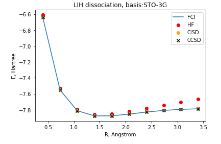
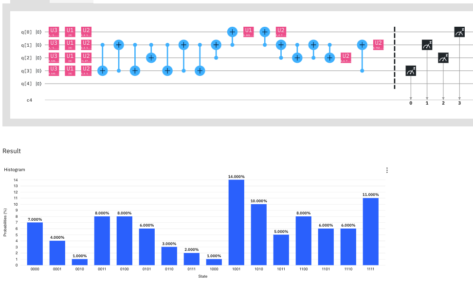

This folder contains research notebooks related to the weeks 2 cohort project topics.

LiH run [see S5_Circuits-LiH.ipynb]:

 \
 \
https://quantum-computing.ibm.com/results/5f124840f3fe2a001bac5b73

for 'bk':\
https://quantum-computing.ibm.com/results/5f0fc5c706b6fe001a0cf890 \

H2 run [see S5_Circuits-H2_on_IBMq-sussex.ipynb]
 

\
https://quantum-computing.ibm.com/results/5f1235e8f3fe2a001bac5a9a

\
https://quantum-computing.ibm.com/results/5f102aed3e5b6a001b4ff992
