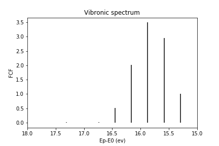

## Project 3: Franck-Condon Factors

In this project we calculate Franck-Condon Factors, which is related to the intensities in spectra of vibrational transitions across electronic surfaces. Spectra can be measured through experiments, but having accurate theoretical calculations of these Franck-Condon Factors allow scientists to instead predict these experimental results. This is especially useful if the chemical species is expensive, difficult to acquire or difficult to study or if the experiment itself is expensive or difficult.

A very brief introduction to the main ideas behind the project are
[here.](https://github.com/CDL-Quantum/CohortProject_2020/blob/master/CDL_2020_docs.pdf)

In the [Project3_LandingPage.pdf](https://github.com/CDL-Quantum/CohortProject_2020/blob/master/Project_3_Franck_Condon_Factors/Project3_LandingPage.pdf), a more technical information about the chemistry and physics behind these Franck-Condon Factors is given. There, you can also find the descriptions of whose solutions are provided below.

# Tasks
This whole project is about theoretical quantum chemistry and spectroscopy in particular.  
On the technical side, we are studying different theoretical methods to investigate and predict chemical properties of molecules. In particular we are focusing on the so called the vibronic transitions and Franck-Condon factors of molecules.  

**Task 1:**   
In this task we use a very simple theoretical model to study the properties of the simplest molecule in the world, **molecular Hydrogen**. 
The purpose of this task is twofold:/
a) this is educational, and any newcommer to the field can quickly get familiar with the technical basics;/
b) In this task we show, that the basic theoretical model (harmonic oscillator approximation) used throughout the project is sound./
To this end, we do the theoretical calculations for hydrogen, then compare the results with actual experimental data, and verify that the theory gives correct predictions.
The calculations for first task for the Hydrogen molecule can be found in [Task1 jupyter notebook](https://github.com/hay-k/CohortProject_2020_w3g7/blob/master/Project_3_Franck_Condon_Factors/Task1.ipynb). Particularly, we calculate transitions from n=0 state of H2 to 10 other vibronic levels for H2+. The figures below show the simulation results from our code implemented in `FCF_helper.py` file which does all the calculations, and the snapshot below is from the paper by Berkowitz and Spohr, _Journal of Electron Spectroscopy and Related Phenomena_, **2**(2):143–152 (1973). The points or vertical bars in our plots correspond to the peak values in the original figure. We can see the great resemblance of our result with the original paper.                                                                              
   
 

**Task 2:**  
In this task we introduce a more sophisticated technical tool (FC.cxx), which can calculate the same chemical properties of molecules as in Task 1, but it can do it for a wide range of molecules, not only hydrogen. This tool is created by a huge research effort in a university, and has been extensively tested already and verified with experimental results. We do not need to test the tool. We just use this tool to investigate the properties of the **Vanadium3 (V3) molecule**. For the visualizations of the results output from FC.cxx tool see our [Task2 jupyter notebook](https://github.com/hay-k/CohortProject_2020_w3g7/blob/master/Project_3_Franck_Condon_Factors/Task2.ipynb).  
**Todo**: add figures

**Task 3:**  
In this task we introduce yet another sophisticated technical tool Gaussia Boson Sampler (GBS) - a photonic special-purpose sampling device by Xanadu programmed via their Strawberryfields software ramework. GBS which tackles the problem from a completely different viewpoint than the tool in the previous task. We investigate the properties of the V3 molecule with this tool and verify that the results are in line with the results produced by the tool in the previous task. One important advantage of this new tool compared to the previous one is that it runs significantly faster for large molecules, and enables theoretical investigation of a few molecules, which are very time consuming and difficult with the previous tool. The investigations are visualized in our [Task3 jupyter notebook](https://github.com/hay-k/CohortProject_2020_w3g7/blob/master/Project_3_Franck_Condon_Factors/Task3.ipynb).   
**Todo**: add figures

**Challenge 1:** 
In this challenge we further investigate the tool introduced in Task3 to reveal more cons and pros about it. This time calculations are done using the loop hafnian approach. The loop hafnian approach uses GBS which would allow the Franck-Condon factors to be calculated using a quantum circuit. We use the result of Task 3 to provide data to a skeleton code provided that uses loop hafnians to calculate the Franck-Condon Factors.

**Challenge 2:** 
In this challenge we are given a freedom to pick a molecule of our liking, and investigate its properties. As discussed during the call, this is a good point for business proposal entrance, so we need to choose a nice molecule for investigation, which can have some interesting business applications

**Challenge 3:** 
We analyze and report all the advantages and disadvantages of all tools used above to calculate the Franck-Condon factors (FCFs). Three methods are carried out using: (a) Hermite polynomials, (b) Gaussian boson sampling (GBS) and (c) loop Hafnian approach.
In all three methods, the determination of the FCFs is the same: calculate the square of the overlap between a _vibronic state within electronic ground_ state and another _vibronic state within electronic excited state_ (these states are connected by the arrow in the figure). Also common to all three methods is that all are in the harmonic oscillator approximation regime where one approximates the region near the minima in the above curves as parabolas. The disadvantage is that it deviates from correct results in the regions where the exact energy surface is no longer an approximation of parabola. These are the regions where the interatomic distances are too small or too large. 

 

- In the Hermite polynomial approach, one directly uses the states of harmonic oscillator, which involves the elegant Hermite polynomials. 

**TODO:** add the formula for calculating FCFs.
 
While it's easer to compute FCF's using Hermite polynomials, one cannot use this method to go beyond the diatomic molecules. In the case of non-linear molecules with more than 2 atoms, the `FC.cxx` tool has funcionality to compute the FCFs via Duschinsky matrix. These approaches are used in Tasks 1 and 2. 

- In the GBS approach, one relies on sampling instead of calculating "exact" probabilities. In this sampling approach, one uses the fact that the normal modes in the harmonic approximation regime are bosonic modes, hence the Gaussian boson sampler (GBS) nicely fits for computing the FCFs. While this method is impractical to simulate classically, one could use the GBS hardware to sample.

- In the loop Hafnian approach, calculating the FCFs is equivalent to calculating the number of perfect matchings of a weighted graph with loops that has P = N + M vertices, where N and M are the vibrational quanta in the potential energy surfaces (see above figure). The number of perfect matchings is the loop Hafnian of the adjacency matrix of the graph. The approach is formalized in the [paper by N. Quesada](https://aip.scitation.org/doi/10.1063/1.5086387).
Calculating the loop hafnian is impractical  but for small numbers of vibrational quanta per normal mode the formula (113) in Quesada's paper significantly improves the calculation of FCFs. 

**Challenge 4:** 
We investigate the advantages and disadvantages of codes licensed for the public domain and those that are licensed for private use

# Business Application
From the business perspective, we first provide a non-technical description of the problem, then we give examples of real-world problems that could use the above methods. We then identify two potential customers who would consider paying to have this problem solved. Finally we present a short video explaining in a non-technical language the value proposition of these innovations to the potential customers.  
For more details refer to the [Business Application found here](./Business_Application.md)

## Presenting your results in your pull request
For your pull request, consider the following for the presentation of your final results:
- Work entirely in the directory for Project 3.
- Edit this README.md file with a highlight of your main technical results.  Provide links to any other files with your detailed results, e.g. Jupyter notebooks.
- For your Business Application, feel free to provide your answers directly in the 
[Business_Application.md](./Business_Application.md) file.
- Do not directly upload your video file (or any other large files) to the repository.  Instead, provide a link e.g. to a YouTube video, or a Google Drive file.
- Include a file contributions.md that lists the contributions of each group member.
