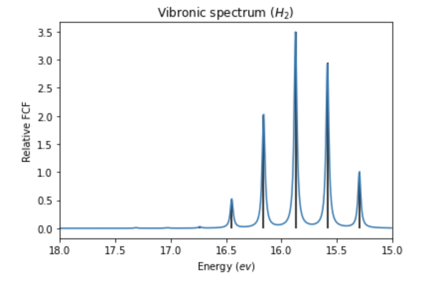
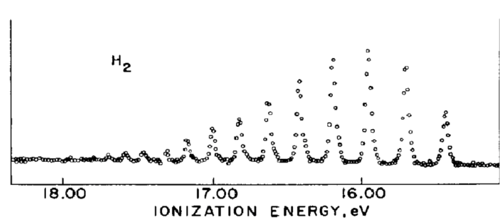
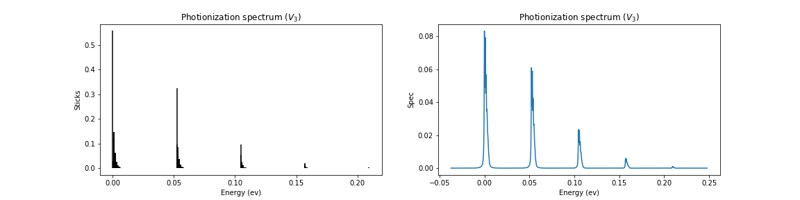
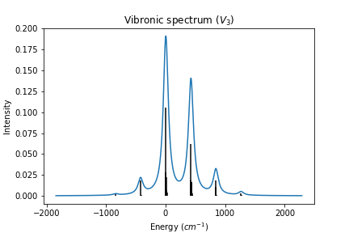
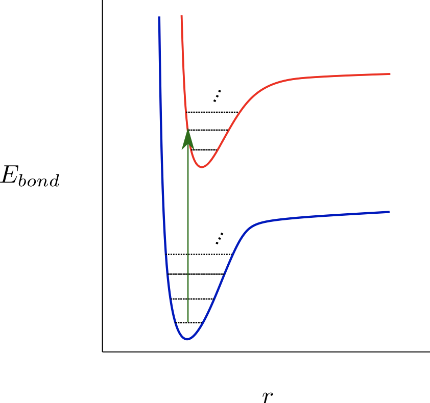
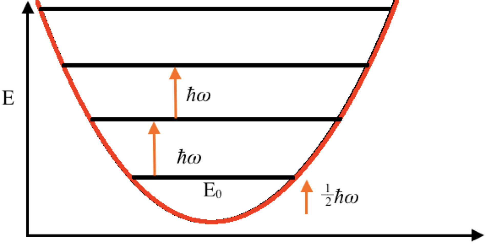

## Project 3: Franck-Condon Factors

In this project we calculate Franck-Condon factors, which is related to the intensities in spectra of vibrational transitions across electronic surfaces. Spectra can be measured through experiments, but having accurate theoretical calculations of these Franck-Condon Factors allow scientists to instead predict these experimental results. This is especially useful if the chemical species is expensive, difficult to acquire or difficult to study or if the experiment itself is expensive or difficult.

A very brief introduction to the main ideas behind the project are presented
[here.](https://github.com/CDL-Quantum/CohortProject_2020/blob/master/CDL_2020_docs.pdf)

In the [Project 3 Landing Page](https://github.com/CDL-Quantum/CohortProject_2020/blob/master/Project_3_Franck_Condon_Factors/Project3_LandingPage.pdf), a more technical information about the chemistry and physics behind these Franck-Condon Factors is given. There, you can also find the descriptions of whose solutions are provided below.

# Tasks
This whole project is about theoretical quantum chemistry and spectroscopy in particular.  
On the technical side, we are studying different theoretical methods to investigate and predict chemical properties of molecules. In particular we are focusing on the so called vibronic transitions and Franck-Condon factors of molecules. Below we list the tasks and additional challenges we addressed.    

**Task 1:**   
In this task we use a very simple theoretical model to study the properties of the simplest molecule in the world, the **molecular Hydrogen**. The purpose of this task is twofold - a) this is educational, and any newcommer to the field can quickly get familiar with the technical basics; b) In this task we show, that the basic theoretical model (harmonic oscillator approximation) used throughout the project is sound. To this end, we do the theoretical calculations for hydrogen, then compare the results with actual experimental data, and verify that the theory gives correct predictions.  
The calculations for first task for the Hydrogen molecule can be found in [Task1 jupyter notebook](./Task1.ipynb). There, we calculate transitions from n=0 vibrionic state of molecular Hydrogen H2 to 10 other vibronic levels for the ion H2+. The figure below show the simulation results from our code implemented in `FCF_helper.py` file which does all the calculations, and the snapshot on the right is from the paper by Berkowitz and Spohr, _Journal of Electron Spectroscopy and Related Phenomena_, **2**(2):143–152 (1973). We can see the great resemblance of our result with the original paper.                                                                              

 

  

**Task 2:**  
In this task we introduce a more sophisticated technical tool (FC.cxx), which can calculate the same chemical properties of molecules as in Task 1, but it can do it for a wide range of molecules, not only for hydrogen. This tool is created by a huge research effort in a university, and has been extensively tested and verified with experimental results. We do not need to test the tool. We just use this tool to investigate the properties of the **Vanadium3 (V3) molecule**. For the visualization specifics of the results output from FC.cxx tool see our [Task2 jupyter notebook](./Task2.ipynb). Here is a plot for photionization spectrum for V3.

 

**Task 3:**  
In this task we introduce yet another sophisticated technical tool, Gaussia Boson Sampler (GBS) - a photonic special-purpose sampling device by Xanadu programmed via their Strawberryfields software framework. GBS tackles the problem from a completely different viewpoint than the tool in the previous task. We investigate the properties of the V3 molecule with this tool and verify that the results are in line with the results produced by the tool in the previous task. One important advantage of this new tool compared to the previous one is that it runs significantly faster for large molecules, and enables theoretical investigation of a few molecules, which are very time consuming and difficult with the previous tool. The investigations are visualized in our [Task3 jupyter notebook](./Task3.ipynb).   

As part of this Task 3, we tried to utilize the Xanadu X8 quantum processor for GBS by modifying the function sample.py from as [sampleX.py](./sampleX.py) more details are in the Google Colab [Task123+more Jupiter notebook](./Task_123+more.ipynb). Unfortunately, we were not able to successfully run on X8 due to "CircuitError: The operation Sgate cannot be used with the target 'X8_01'" which we didn't have time to resolve.

# Challenges  

**Challenge 1:**  
In this challenge we further investigate the tool introduced in Task3 to reveal more cons and pros about it. This time calculations are done using the loop hafnian approach. The loop hafnian approach uses GBS which would allow the Franck-Condon factors to be calculated using a quantum circuit. We use the result of Task 3 to provide data to a skeleton code provided that uses loop hafnians to calculate the Franck-Condon Factors. Particularly, instead of sampling a photonic device and approximating the probabilities of output energies based on the sampling results, we compute the exact probabilities of the outputs using loop hafnians. The figure below is plotted using those exact probabilities.

**Challenge 2:**   
In this challenge we are given a freedom to pick a molecule of our liking, and investigate its properties. As a nice molecule for investigation, we chose ammonia NH3. The reason for the choice is connected to the business application where we discuss the role of spectroscopy in "wine authentication". Nitrogenous compounds are a vital part of all living organisms and plays a vital role in the winemaking process. Ammonia is one of the essential nitrogenous compounds. Ammonia’s role in the fermentation process is it helps serve as nutrients for growth and metabolic activity of yeast during fermentation.  
The challelnge 2 computations are added to the [Task 2 jupyter notebook](./Task2.ipynb) where we use external resources to solve the task. Particularly, we take the geometrical data for NH3 and NH3+ from the [NIST website](https://cccbdb.nist.gov/geom1x.asp), then we use `pyscf` library to preprocess the data before creating the format (via `dump_frequency_analysis` function in `utils.py`) needed to prceed with the usual steps.

We also looked at the Vibronic spectra for Formic Acid since it is one of the example molecules from the Xanadus Quantum Chemistry package via StrawberryFields.
The Hayk's functions for generating the input file for the FC.xcc code was utilized and the steps similar to Task 3 were repeated to generate and compare the spectral graphs.
Results are in the appropriate section of the [Task123+more Jupiter notebook](./Task_123+more.ipynb). This notebook is set up for running the Tasks under Google Colab.

**Challenge 3:** 
We analyze and report all the advantages and disadvantages of all tools used above to calculate the Franck-Condon factors (FCFs). Three methods are carried out using: (a) **Hermite polynomials**, (b) **Gaussian boson sampling** (GBS) and (c) **loop Hafnian** approach.
In all three methods, the determination of the FCFs is the same:   calculate the square of the overlap between a _vibronic state within electronic ground_ state and another _vibronic state within electronic excited state_ (these states are connected by the arrow in the figure).
Also common to all three methods is that all are in the harmonic oscillator approximation regime where one approximates the region near the minima in the above curves as parabolas. The disadvantage is that it deviates from correct results in the regions where the exact energy surface is no longer an approximation of parabola. These are the regions where the interatomic distances are too small or too large.    

- In the Hermite polynomial approach, one directly uses the states of harmonic oscillator, which involves the elegant Hermite polynomials.  

  
Then the formula for calculating the FCF is given by  

  

where  is the state before/after the transition, and the overlap can be understood as dot product. 
This calculation is implemented in the `FCF_helper.py` file. This implementation is restricted to diatomic molecules and cannot handle more complex ones. In the case of non-linear molecules with more than 2 atoms, the `FC.cxx` tool has funcionality to compute the FCFs. While this implementation accounts for large molecules with potentially complex structure through the use of Doktorov transformations, it still employs Hermite polynomials explicitly (via recursive coalcualtion). These approaches are used in Tasks 1 and 2. 

- In the GBS approach, one relies on sampling instead of calculating "exact" probabilities. In this sampling approach, one uses the fact that the normal modes in the harmonic approximation regime are bosonic modes, hence the Gaussian boson sampler (GBS) nicely fits for modeling the computation of the FCFs. While this method is impractical to simulate classically, one could use the GBS hardware to sample.

- In the loop Hafnian approach, calculating the FCFs is equivalent to calculating the number of perfect matchings of a weighted graph with loops that has P = N + M vertices, where N and M are the vibrational quanta in the potential energy surfaces (see above figure). The number of perfect matchings is the loop Hafnian of the adjacency matrix of the graph. The approach is formalized in the [paper by N. Quesada](https://aip.scitation.org/doi/10.1063/1.5086387).
Calculating the loop hafnian is impractical  but for small numbers of vibrational quanta per normal mode the formula (113) in Quesada's paper significantly improves the calculation of FCFs. 

**Challenge 4:** 
We investigate the advantages and disadvantages of codes licensed for the public domain and those that are licensed for private use. The business aplication and other discussions can be found in our [challenge 4 file.](./Challenge4.md)

# Business Application

From the business perspective, we first provide a non-technical description of the problem, then we give examples of real-world problems that could use the above methods. We then identify two potential customers who would consider paying to have this problem solved. Next, we provide our opinion about pros and cons of public and private code, also recommend to talk to a lawyer when it comes to your startup and IP related issues as what we discuss there are not opinions of lawyers. Finally we present a short video explaining in a non-technical language the value proposition of these innovations to the potential customers.  
For more details refer to our [Business Application file.](./Business_Application.md)

