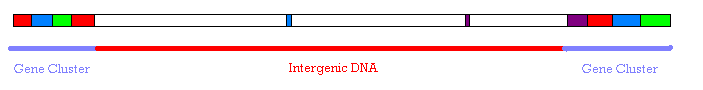
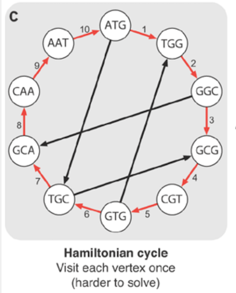
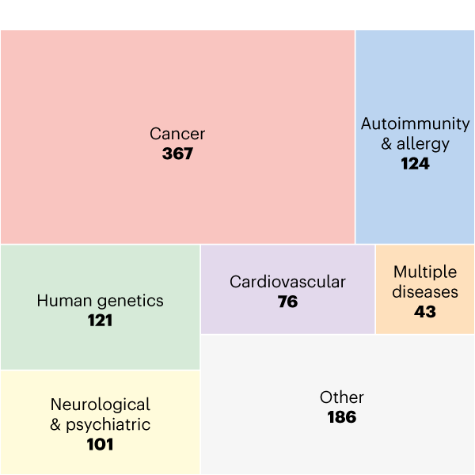

## Quantum Cohort Project Business Application: Annealing the Ising model 

## 1. The technical problem that we solved in this exercise.

The Ising model is a simple mathematical model that describes a system of particles on a lattice that 
interact with one through simple, pair-wise interactions. Despite the simplicity of the model,
it can be used to understand complex physical phenomena such as phase-transitions. In this exercise, in [Task 1](Task_1.ipynb),
we started by simulating simple Ising model and determined its ground state configuration using simulated Annealing. The convergence
of this simulated annealing procedure is dependent on the "annealing" schedule which, over-time, reduces the temperature 
of the simulation until convergence is achieved. Therefore, in [Task 2](Task_2.ipynb) we investigated the effect of
different schedules to the speed of convergence for the ising models. Finally, in [Task 3](Task_3.ipynb), we applied our methods used to solve the Ising model
to simulate a hydrogen atom with a larger number of pair-wise interactions in the Hamiltonian (up to 4).

 
## 2. Examples of real-world problems this solution can solve.
 
<b>Problem:</b> Intergenic regions, the stretches of DNA sequences between genes that were previously thought to be “junk DNA” ,
are now showing some promise in terms of their role in enhancing/activating discrete sets of genes over distances of several thousand pairs. 
These intergenic regions make up at least 50%+ of a human genome, but are largely misunderstood. Sequencing DNA is complex/inefficient and we feel that we could help make that process more efficient, and also focus on 
intergenic regions as a niche area.

<b>Some more details on the problem from secondary research:</b> 
 
“What makes sequencing the genome hard is that there is currently no way to read long strands with accuracy.
Current DNA sequencing machines are only capable of efficiently reading relatively short strands, e.g., 1000 base pairs, compared to the over
three billion contained in the whole human genome. Scientists therefore cut strands into shorter fragments and then reassemble the pieces.
 
To construct a genome from short reads, it's necessary to construct a graph of those reads. We do it by breaking the reads into k-mers and 
assembling them into a graph.

In this example, we have a k-mer of 3. We can reconstruct the genome by visiting each node once as in the diagram. This is known as the Hamiltonian path.

<b><em>Unfortunately, constructing such a path is NP-hard. It's not possible to derive an efficient algorithm for solving it.</em></b>

<b>Opportunity:</b> How cells, tissues, and organisms interpret the information encoded in the genome has vital implications for our understanding of 
development, health, and disease. In the graphic below one can see how genome data is used in the studies of human diseases. 
 

<b>We believe that we can use Markov Chain Monte Carlo methods on quantum annealing machines to better understand intergenic regions.</b> 
There is already evidence that scientists have used quantum annealing to better understand the genome and that there has been
an “significant increase in efficiency.”
 
<b>Evidence:</b>
 
    “Genome assembly using quantum and quantum-inspired annealing” (abstract): 
 
<em>“Recent advances in DNA sequencing open prospects to make whole-genome analysis rapid and reliable, which is promising for 
various applications including personalized medicine. <b>However, existing techniques for de novo genome assembly, which is used for 
the analysis of genomic rearrangements, chromosome phasing, and reconstructing genomes without a reference, require solving tasks 
of high computational complexity. Here we demonstrate a method for solving genome assembly tasks with the use of quantum and 
 quantum-inspired optimization algorithms.</b> Within this method, we present experimental results on genome assembly using
quantum annealers both for simulated data and the φX 174 bacteriophage. <b>Our results pave a way for a significant increase 
in the efficiency of solving bioinformatics problems with the use of quantum computing technologies and, in particular, 
quantum annealing might be an effective method. We expect that the new generation of quantum annealing devices would outperform 
 existing techniques for de novo genome assembly.</b> To the best of our knowledge, this is the first experimental study of de novo
genome assembly problems both for real and synthetic data on quantum annealing devices and quantum-inspired algorithms.”</em>

## 3 .  Potential customer.

Top 10 gene sequencing companies by revenue:
 
<b>1. Illumina</b>
 * $3.33B revenues in 2018
 * Looking to lower the costs of gene sequencing
 
<b>2. Thermo Fisher Scientific</b>
* $418.36M - revenues from gene sequencing

<b>3. BGI Genomics</b>
* $311.61M revenue in 2017
* Top genetic testing company in China

<b>4. Agilent Technologies</b>
* $250M revenue in 2018
* Leader in lab equipment

<b>5. 10X Genomics</b>
* $146M revenues in 2018

<b>6. Qiagen</b>
* $140M revenues in 2018

<b>7. Genewiz</b>
* Q1 2019 revenues $33M

<b>8. Macrogen</b>
* $97.01M revenues in 2018

<b>9. Pacific Biosciences</b>
* $78.63M in revenues in 2018
* Acquired by Illumina

<b>10. Oxford Nanopore Technologies</b>
* $18.1M revenues in 2017
* Raised $200M in 2018

