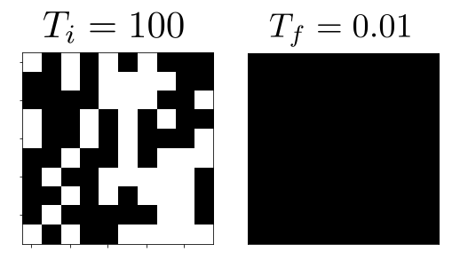
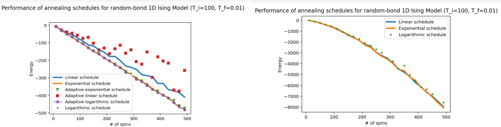
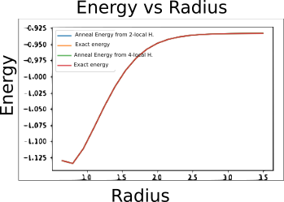
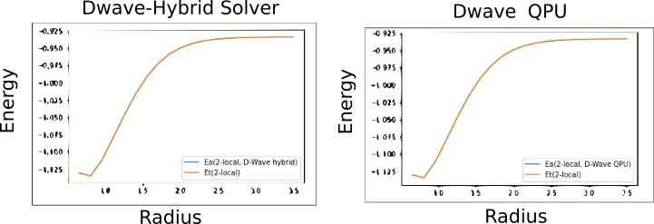
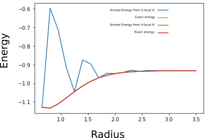

## Project 4: Ising Annealing

Our final week's project will guide you through the process of mapping an electronic structure Hamiltonian to a classical Ising model, and then solving for the groundstate of the model using a thermal anneling Monte Carlo simulation.

A very brief introduction to the main ideas behind the project, and the basics of the Monte Carlo method are
[here.](https://github.com/CDL-Quantum/CohortProject_2020/blob/master/CDL_2020_docs.pdf)

In our [Project4_LandingPage.pdf](https://github.com/CDL-Quantum/CohortProject_2020/blob/master/Project_4_Ising_Annealer/Project4_LandingPage.pdf),
we provide more technical information the Ising Hamiltonians involved.
Click on this link to begin learning about your tasks for this week!

## Task summaries

### [Task 1: ](Task_1.ipynb) 2D Ferromagnetic Ising on a PBC Square Lattice
In this task we determined the ground state configuration of the two-dimensional ferromagnetic Ising model through simulated annealing
using an exponential annealing schedule. We were able to visualize the convergence of the Ising model from a
random initial state to the ground state configuration. The Figure below illustrates the results.

<figure>
  
  <figcaption>  <b>Figure: </b>  <em><b>Left-</b> The initial state of Ising model.  <b>Right-</b> The ground state configuration of the Ising model.</em> </figcaption>
</figure>

### [Task 2: ](Task_2.ipynb) Some Simple Spin Glasses
In this task, two different annealing schedules (the exponential and linear schedule) were implemented and compared
against one another. These two schedules were tested on the Ising model aswell as the fully 
connected Mattis model. The results of these calculations are illustrated in the figures below.

<figure>
  
  <figcaption>  <b>Figure: </b> <em> <b>Left-</b> The energy vs number of spin objects for an Ising model using a linear annealing schedule and an exponential schedule. 
  <b>Right-</b> The energy vs number of spin objects for the Mattis model using the linear and exponential annealing schedule. </em> </figcaption>
</figure>

### [Task 3: ](Task_3.ipynb) Electronic Structure Calculations using Generalized Ising Hamiltonians
 
Using the annealing schedule determined from the previous task, we used it to solve a Hamiltonian representing 
the hydrogen atom as a function of the radius. For each radius we determined the ground state energy
using simulated annealing using the exponential annealing schedule. Our results are illustrated below.

<figure>
  
  <figcaption> <b>Figure: </b> <em>The ground state energy of the hydrogen atom solved using a simulated annealing procedure as a function of the radius. The blue curve is the energy obtained from simulated annealing while the orage line represents the exact energy. Both curves overlap.</em> </figcaption>
</figure>

## [Further Challenges: ](Challenge.ipynb)

For the [further challenges](Challenge.ipynb), starting from the 4-local Hamiltonian for Hydrogen from Task 3, we 
applied the transformation from [Xi et al. (2017). arxiv:1706.00271](https://arxiv.org/pdf/1706.00271.pdf) to
map this Hamiltonian into a 2-local Hamiltonian. Once this was accomplished, we benchmarked 
the transformation by calculating the the Energy as a function of radius using the 
4-local aswell as the 2-local Hamiltonians and compared the results. The figure below indicates that all
methods agree with one another and that they match the exact solution.

<figure>
  
  <figcaption> <b>Figure: </b>  <em> The ground state energy of the hydrogen atom solved using a simulated annealing procedure as a function of the radius for the 2-local and 4-local Hamiltonians. All curves overlap.  </em> </figcaption>
</figure>

Once we verified that the 2-local Hamiltonian was correct, we implemented this Hamiltonian
in the D-Wave machine and used Quantum annealing to determine the Energy as a function
of the radius for the Hydrogen molecule. For this task we used the QPU aswell as the 
Hybrid solver. The results are plotted below indicating exact agreement between the 
different methods. Furthermore, the results from D-wave match exactly the results obtained 
from simulated annealing and the exact solution.

 

<figure>
  
  <figcaption> <b> Figure: </b>  <em> <b>Left-</b> The ground state energy of the 2-local hydrogen atom Hamiltonian solved 
  using D-Wave hybrid solver. <b>Right-</b> The ground state energy of the 2-local hydrogen atom Hamiltonian solved 
  using D-Wave QPU.  </em> </figcaption>
</figure>

It is worth noting that the transformed 2-local Hamiltonian requires more annealing steps
than the 4-local Hamiltonian. Therefore more steps are used in order to allow the 2-local Hamiltonian
to converge. An illustration of the failure of the annealing process for the 2-local Hamiltonian is shown below.

 

<figure>
  
  <figcaption> <b>Figure: </b> <em>The ground state energy of the 2-local hydrogen atom Hamiltonian solved 
  using simulated annealing. Less iterations were used to demonstrate the failure of the 2-local Hamiltonian
  to determine the ground state configuration.</em> </figcaption>
</figure>

## Business Application
One again, your team is asked to complete a Business Application. Questions you will be asked are:

* Explain to a layperson the technical problem you solved in this exercise.
* Explain or provide examples of the types of real-world problems this solution can solve.
* Identify at least one potential customer for this solution - ie: a business who has this problem and would consider paying to have this problem solved.
* Prepare a 90 second video explaining the value proposition of your innovation to this potential customer in non-technical language.

For more details refer to the [Business Application found here](./Business_Application.md)

## Presenting your results in your pull request
For your pull request, consider the following for the presentation of your final results:
- Work entirely in the directory for Project 4.
- Edit this README.md file with a highlight of your main technical results.  Provide links to any other files with your detailed results, e.g. Jupyter notebooks.
- For your Business Application, feel free to provide your answers directly in the 
[Business_Application.md](./Business_Application.md) file.
- Do not directly upload your video file (or any other large files) to the repository.  Instead, provide a link e.g. to a YouTube video, or a Google Drive file.
- Include a file contributions.md that lists the contributions of each group member.
